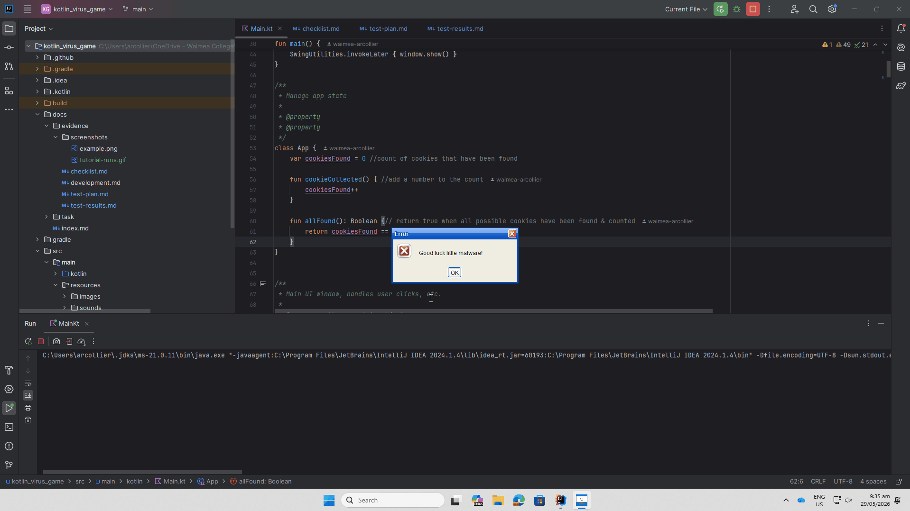
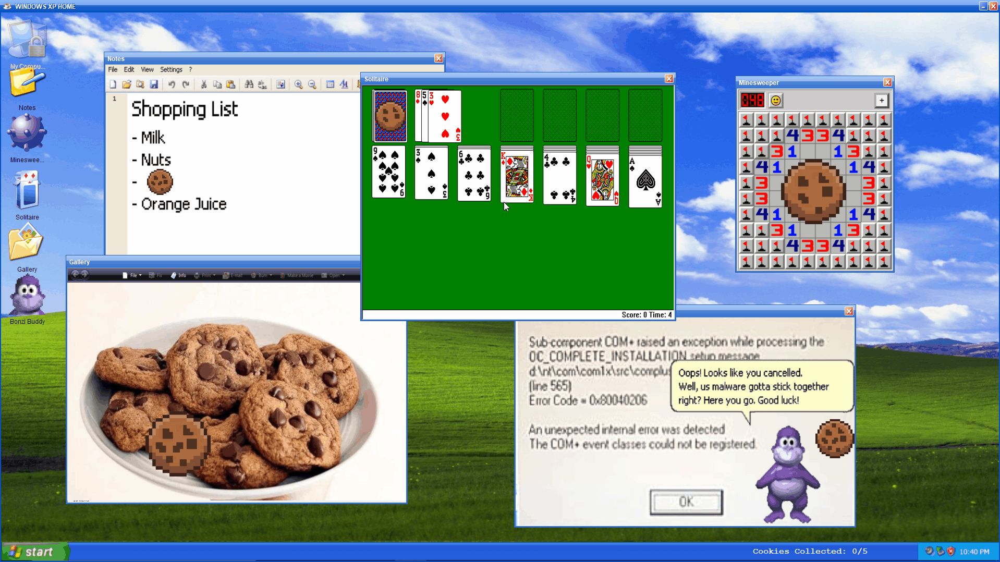
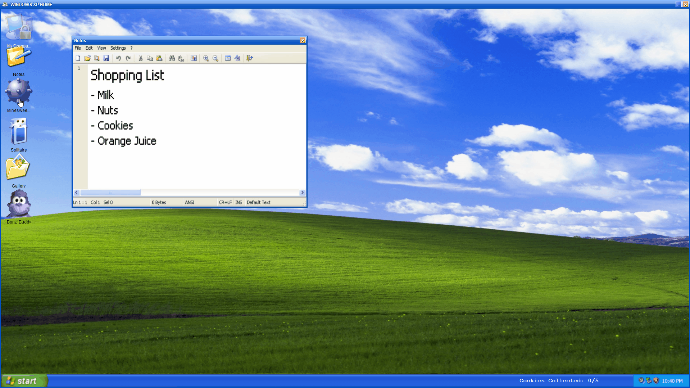
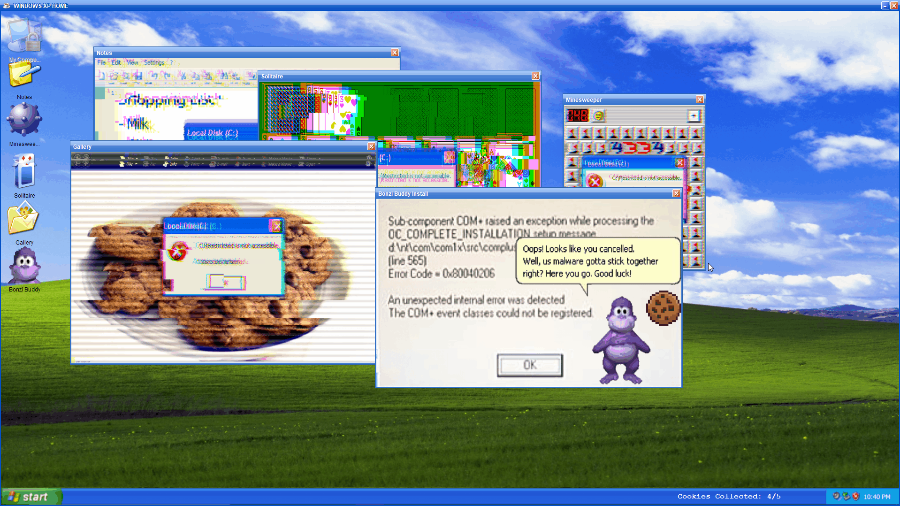

# Results of Testing

The test results show the actual outcome of the testing, following the [Test Plan](test-plan.md)

---

## Gameplay: Tutorial runs - VALID, INVALID

Tutorial displays on launch, and displays all dialogs

### Test Data To Use

- INVALID: Clicking outside tutorial window, closing with the x,
- VALID: continuing with the ok button

### Test Result

Tutorial progresses no matter which button is pressed, and cannot be clicked off of

---

## Setup: Main window setup - BOUNDARY

Main window opens in correct state

### Test Data To Use

Main window opens after completing tutorial.
- BOUNDARY: Game starts with zero cookies

### Test Result

The main window opens with all child windows closed, the "my computer" button is disabled, and cookies start at 0/5 without crashing

---

## Gameplay: Child windows open and close correctly - VALID, INVALID, BOUNDARY

Child windows open in correct state and can be moved, closed, and reopened

### Test Data To Use

open & close child windows, move windows

- VALID: click within buttons
- BOUNDARY: hover button bounds
- INVALID: click outside of buttons, click multiple times

### Test Result

Buttons for each child window opens the corresponding window, buttons are within bound of their icon image. The windows can only open once and pressing the button again has no affect. Hovering over buttons shows that it is clickable. Child windows move when dragged, close on click of exit button, and reopen without errors or any states changing prematurely.

---

## Gameplay: Target buttons function correctly - VALID, INVALID, BOUNDARY

Target buttons are invisible and in correct areas

### Test Data To Use

- INVALID: Click outside of target
- BOUNDARY: Hover over target bounds
- VALID: Click in target

### Test Result

Clicking outside bounds of the target does nothing. Hovering over target shows that it is clickable. Clicking within the target disables the button, changes the child window state and shows the cookie.

---

## Gameplay: Cookie can be collected - VALID, INVALID, BOUNDARY

Cookie collects when clicked

### Test Data To Use

- INVALID: click outside of cookie
- BOUNDARY: hover over cookie
- VALID: click inside cookie
### Test Result

Clicking outside bounds of the cookie does nothing. Hovering over cookie shows that it is clickable. Clicking within the cookie disables and hides the button, changes the child window state and adds one to the to cookie count.

---

# Gameplay: Windows maintain updated state after closing

Windows will not reset states after closing and reopening

### Test Data To Use

Close & reopen window after target clicked. Close & reopen window after cookie clicked

### Test Result

Window maintains state after it has been changed, reopening shows the same state the window was closed in. Works for both possible states (after & infected)

---

## Gameplay: Game progresses & functions when all cookies are collected - BOUNDARY

When all cookies have been collected, the game progresses to the next step

### Test Data To Use

Reopen windows, test windows
BOUNDARY: All cookies are collected, 5/5

### Test Result

When the cookie count reaches 5/5 cookies, no crashes occur. Each window closes and a dialog window pops up. After dialog is dismissed, the computer app should is enabled, shown by the icon changing. All other windows remain functional and maintain state after the game has progressed

---

## Gameplay: Computer window functional - VALID, BOUNDARY, INVALID

Computer window once enabled should open correctly

### Test Data To Use

open & close window, move window

- VALID: click within button
- BOUNDARY: hover button bounds
- INVALID: click outside of button, try to open window multiple times
### Test Result

Computer window opens and closes without changing or breaking, window button bounds match icon, window is movable. Hovering over button shows it is clickable.

---

## Gameplay: Game completes when shut-down button is pressed - BOUNDARY, VALID, INVALID

When shut down button is pressed the game end is run

### Test Data To Use

BOUNDARY: Shut down button bounds
INVALID: click outside button, click outside dialog, close dialog with x, try to click on end screen
VALID: click inside button

### Test Result

Clicking outside bounds of the button does nothing. Hovering over button shows that it is clickable. Clicking within the button disables the button, closes the computer window, disables all main window buttons, displays dialog, progresses even with dialog x press, and win screen displays without any leftover buttons.

---

