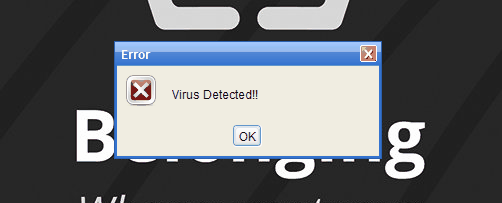

# Results of Testing

The test results show the actual outcome of the testing, following the [Test Plan](test-plan.md)

---

## Gameplay: Tutorial runs - VALID, INVALID

Tutorial displays on launch, and displays all dialogs

### Test Data To Use

- INVALID: Clicking outside tutorial window, closing with the x,
- VALID: continuing with the ok button

### Test Result

Tutorial progresses no matter which button is pressed, and cannot be clicked off of

---

## Setup: Main window setup - BOUNDARY

Main window opens in correct state

### Test Data To Use

Main window opens after completing tutorial.
- BOUNDARY: Game starts with zero cookies

### Test Result

Comment on test result. Comment on test result. Comment on test result. Comment on test result. Comment on test result. Comment on test result.

---

## Gameplay: Child windows open and close correctly - VALID, INVALID, BOUNDARY

Child windows open in correct state and can be moved, closed, and reopened

### Test Data To Use

open & close child windows, move windows

- VALID: click within buttons
- BOUNDARY: hover button bounds
- INVALID: click outside of buttons, click multiple times

### Test Result

Comment on test result. Comment on test result. Comment on test result. Comment on test result. Comment on test result. Comment on test result.

---

## Gameplay: Target buttons function correctly - VALID, INVALID, BOUNDARY

Target buttons are invisible and in correct areas

### Test Data To Use

- INVALID: Click outside of target
- BOUNDARY: Hover over target bounds
- VALID: Click in target

### Test Result

Comment on test result. Comment on test result. Comment on test result. Comment on test result. Comment on test result. Comment on test result.

---

## Gameplay: Cookie can be collected - VALID, INVALID, BOUNDARY

Cookie collects when clicked

### Test Data To Use

- INVALID: click outside of cookie
- BOUNDARY: hover over cookie
- VALID: click inside cookie
### Test Result

Comment on test result. Comment on test result. Comment on test result. Comment on test result. Comment on test result. Comment on test result.

---

# Gameplay: Windows maintain updated state after closing

Windows will not reset states after closing and reopening

### Test Data To Use

Close & reopen window after target clicked. Close & reopen window after cookie clicked

### Test Result

Comment on test result. Comment on test result. Comment on test result. Comment on test result. Comment on test result. Comment on test result.

---

## Gameplay: Game progresses when all cookies are collected - BOUNDARY

When all cookies have been collected, the game progresses to the next step

### Test Data To Use

BOUNDARY: All cookies are collected, 5/5
### Test Result

Comment on test result. Comment on test result. Comment on test result. Comment on test result. Comment on test result. Comment on test result.

---

## Gameplay: Computer window functional - VALID, BOUNDARY, INVALID

Computer window once enabled should open correctly

### Test Data To Use

open & close window, move window

- VALID: click within button
- BOUNDARY: hover button bounds
- INVALID: click outside of button
### Test Result

Comment on test result. Comment on test result. Comment on test result. Comment on test result. Comment on test result. Comment on test result.

---

## Gameplay: Game completes when shut-down button is pressed - BOUNDARY, VALID, INVALID

When shut down button is pressed the game end is run

### Test Data To Use

BOUNDARY: Shut down button bounds
INVALID: click outside button, try to click again, click outside dialog, close dialog with x, try to click on end screen
VALID: click inside button

### Test Result

Comment on test result. Comment on test result. Comment on test result. Comment on test result. Comment on test result. Comment on test result.

---

